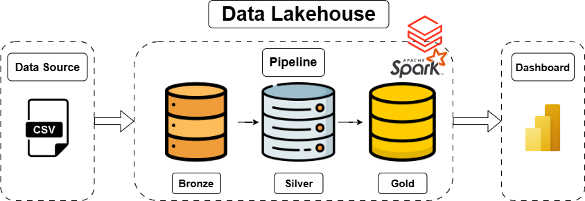
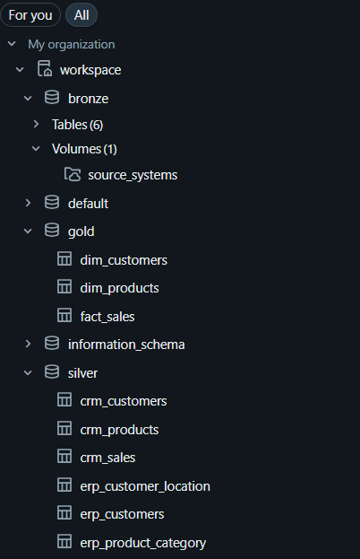
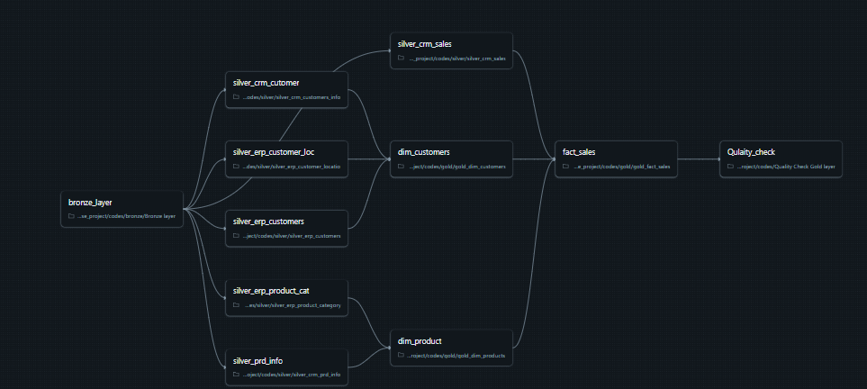
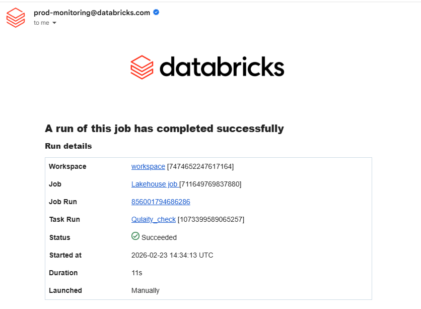
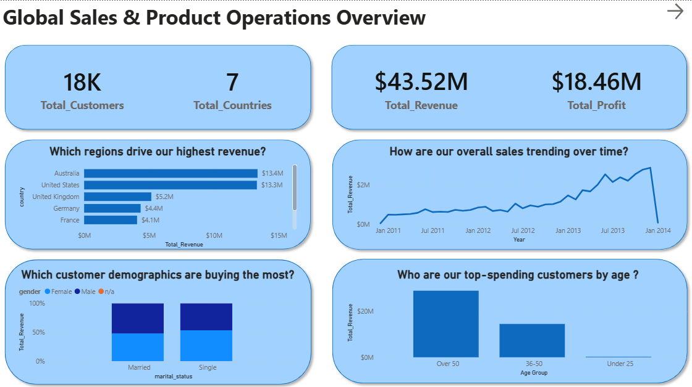

# ⚙️ Automated E-Commerce Data Pipeline: Databricks & PySpark

## 📌 Project Overview
This project showcases a robust, fully automated Data Engineering ETL pipeline built in Databricks. The primary objective was to architect a reliable system that ingests raw e-commerce data, transforms it using distributed processing (PySpark), and orchestrates the workflow with built-in monitoring and failure alerting. 

While the data is ultimately served to a Power BI dashboard for business consumption, the core of this project focuses on scalable data architecture, automated orchestration, and data quality enforcement using the Medallion Architecture.

---

## 🏗️ Architecture & ETL Workflow

### 1. Data Ingestion (Databricks Volumes)
The pipeline begins by landing raw, unstructured e-commerce data (CSV files) securely into **Databricks Unity Catalog Volumes**. This serves as our secure landing zone and the starting point for the Bronze layer of our Medallion architecture.

### 2. Data Transformation (PySpark)
I developed modular PySpark scripts to process the data through the Medallion stages:
* **Bronze to Silver:** Read raw data from Volumes, enforced strict schemas, handled missing/null values, and dropped duplicates.
* **Silver to Gold:** Applied complex business logic, flattened product hierarchies, and structured the data into a Star Schema (Fact and Dimension tables) optimized for BI consumption.
* **SCD Type 2 Implementation:** Engineered Slowly Changing Dimensions using PySpark window functions to accurately track historical manufacturing costs over time (`prd_start_dt`, `prd_end_dt`).

### 3. Orchestration & Automation (Databricks Jobs)
To ensure the pipeline runs without manual intervention, I packaged the PySpark notebooks into a **Databricks Workflow/Job**. 
* Configured task dependencies (e.g., the Silver layer processing will not trigger until the Bronze ingestion completes successfully).
* Scheduled the pipeline to run on an automated trigger to keep the downstream data warehouse fresh.

### 4. Monitoring & Alerting
Data reliability is critical. I configured Databricks Job notifications to immediately alert stakeholders in the event of a pipeline failure. This ensures that data quality issues or cluster failures are caught and addressed before impacting business reporting.

*(**Image Instruction for Hozayfa:** Place your screenshot of the failure email notification here)*

---

## 📊 Data Serving (Power BI)
The fully transformed, Gold-layer tables are securely connected to Power BI via DirectQuery/Import. Because the heavy lifting (joins, historical tracking, data cleaning) was handled upstream by PySpark, the Power BI data model is highly performant.

* Features a clean 1-to-many Star Schema.
* Surfaces dynamic KPIs for C-suite executives and operational metrics for Supply Chain managers.

MORE INFO IN DATA_LAKEHOUSE_DASHBOARD FOLDER

---

## 🛠️ Technology Stack
* **Compute & Orchestration:** Databricks, Databricks Workflows (Jobs)
* **Data Processing:** PySpark, Python
* **Storage:** Databricks Unity Catalog Volumes (Medallion Architecture)
* **Monitoring:** Databricks Email Alerts
* **Data Visualization:** Power BI
* **Version Control:** Git & GitHub

## 💡 Conclusion
By building this pipeline in Databricks, I transformed manual, fragile data updates into a resilient, automated process. The implementation of PySpark transformations, workflow orchestration, and proactive alerting ensures that the business always has access to accurate, timely, and historically tracked e-commerce data.
